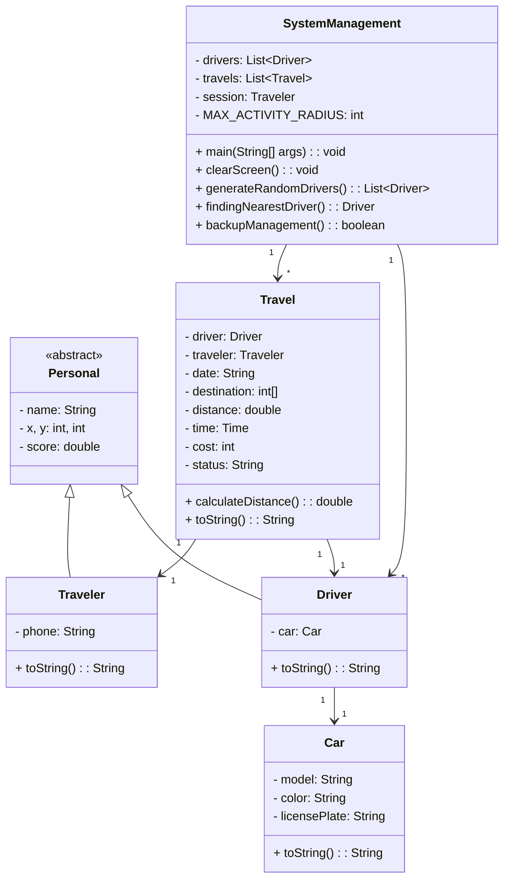

# HeyTaxi 🚖

[Persian](README-Persian.md)

**HeyTaxi** is a simple command-line-based *online taxi simulation* written in Java. It randomly generates drivers and allows passengers to request a travel. The system automatically selects the closest available driver based on the passenger's location, and simulates a full travel experience in the terminal.

## Features

- Automatic random generation of drivers
- Register and manage passengers
- Request travels with auto-assigned nearby drivers
- Travel tracking after request
- Rating system for drivers and passengers

## UML Structure

The diagrams below illustrate the structural design and class relationships defined in the project:



## Getting Started

### Prerequisites
- Java 17 or higher
- Maven

### Run the Project

Clone the repository and use Maven to build the project:

```bash
git clone https://github.com/aref-daei/heytaxi.git
cd heytaxi
mvn clean compile
```

Then run the program manually:

```bash
java -cp target/classes SystemManagement
```

## Development Status

This project is under active development. Planned features include:

- Persistent data storage (file or database)
- Graphical user interface (GUI)

## License

This project is licensed under the MIT License. See the [LICENSE](LICENSE.txt) file for more details.
